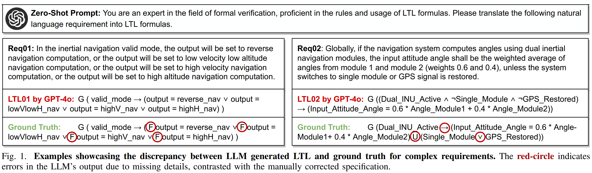
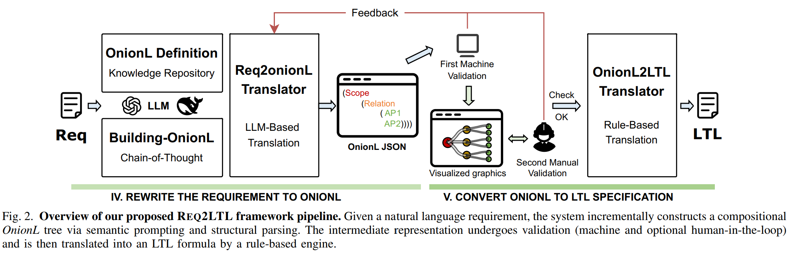
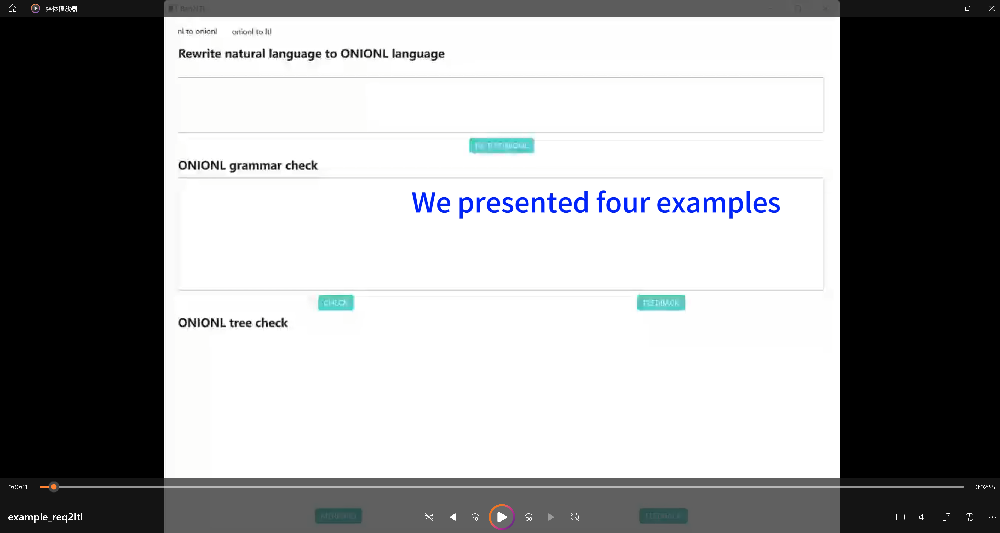

# REQ2LTL: Natural Language Requirements to LTL

REQ2LTL is a powerful tool designed to automatically translate natural language (NL) software requirements into formal Linear Temporal Logic (LTL) specifications. This framework bridges the gap between informal textual requirements and precise, verifiable formal language, which is crucial for formal verification, especially in safety-critical domains like aerospace.

## 🎯 The Challenge

*Figure 1. Key pain points that motivate the REQ2LTL pipeline.*

Translating NL software requirements into LTL formulas is a critical but challenging task. Manual translation is time-consuming and error-prone. Existing automated approaches, whether rule-based or purely learning-based (including direct application of Large Language Models like GPT-40), often struggle with:

* **Complexity and Ambiguity**: Real-world industrial requirements are often complex, ambiguous, and contain implicit semantics.
* **Logical Depth**: Deeply nested logical structures and context-specific constraints are common.
* **Syntactic and Semantic Correctness**: Ensuring both valid LTL syntax and accurate semantic representation is difficult for LLMs alone. LLMs can excel at extracting atomic propositions but falter with global logical synthesis.

---

## ✨ Our Solution: REQ2LTL

*Figure 2. REQ2LTL system components and data flow.*

REQ2LTL offers a modular, robust, and accurate framework by leveraging the strengths of LLMs for semantic understanding and deterministic rule-based methods for logical synthesis. At its core is a novel hierarchical intermediate representation called **OnionL**.

This tool aims to achieve high semantic accuracy and perfect syntactic correctness, as demonstrated in its evaluation on real-world aerospace requirements (88.4% semantic accuracy, 100% syntactic correctness).

---

## 🔑 Key Features

* **Hierarchical Semantic Decomposition**: Uses LLMs to break down NL requirements into a structured intermediate representation (OnionL).
* **OnionL Intermediate Representation**: A tree-structured language that explicitly encodes scopes (temporal, mode), logical relations, and atomic propositions, bridging NL and LTL.
* **Rule-Based LTL Synthesis**: Deterministically translates the validated OnionL structure into syntactically correct LTL formulas.
* **Validation**: Incorporates both automated machine validation and optional human-in-the-loop validation via visualized OnionL structures.
* **High Accuracy**: Significantly outperforms existing methods on both academic benchmarks and complex industrial requirements.
* **Transparency and Modularity**: The two-stage process and intermediate representation offer insight into the translation process.

---

## 🛠️ How It Works & Demo

The REQ2LTL framework operates through a systematic pipeline:

1. **Input**: A natural language software requirement.
2. **REQ2ONIONL Translator**:
   * **LLM-Based Translation**: An LLM (e.g., GPT-4o) is used to parse the NL requirement.
   * **Knowledge Repository**: The translation is guided by the formal definition of OnionL (syntax and semantic composition).
   * **Building-OnionL Algorithm (Chain-of-Thought)**: A two-stage, prompt-driven algorithm systematically constructs the OnionL tree.
     * *Stage 1: Macro-Structure Extraction*: Identifies global scopes (temporal or mode).
     * *Stage 2: Recursive Clause Decomposition*: Decomposes clauses into nested scopes, relations, and normalizes atomic propositions.
   * **Output**: An OnionL JSON structure representing the requirement.
3. **OnionL Validation**:
   * **First Machine Validation**: The OnionL JSON undergoes a depth-first traversal to check for structural well-formedness, correct operator arity, type validity, and other composition constraints. Redundant or malformed constructs are canonicalized.
   * **Second Manual Validation (Optional)**: The OnionL JSON can be rendered into a visual tree diagram (e.g., using Mermaid) for human engineers to inspect and refine the semantic interpretation. This supports a "human-in-the-loop" feedback cycle.
4. **ONIONL2LTL Translator**:
   * **Rule-Based Translation**: The validated OnionL structure is deterministically translated into a standard LTL formula. Each OnionL element (scope, relation, atomic proposition) is mapped to its corresponding LTL syntax.
   * This process is structure-preserving, ensuring that each validated OnionL tree produces a distinct, syntactically and semantically correct LTL formula.
5. **Output**: A formal LTL specification.

**Interactive Walkthrough**

* Click NL TO ONIONL to convert natural language to ONIONL.
* Click CHECK to verify the generated OnionL structure. If it is incorrect, click FEEDBACK to regenerate it.
* Click MERMAID to visualize OnionL as a tree diagram. If there is an error, describe it in the lower-right input box and click FEEDBACK to regenerate.
* Click ONIONL TO LTL to translate OnionL into the corresponding LTL formula.

> 点击上方封面图即可在线查看或下载完整演示视频。

Due to the privacy of space data, we are currently unable to publicly disclose all real data. Therefore, we have omitted some necessary details from the examples in the video.

---

## 🏆 Core Advantages

* **Handles Complexity**: Effectively processes deeply nested logic and implicit temporal semantics common in industrial requirements.
* **Reduced Error Compounding**: The structured approach and intermediate validation help mitigate errors that LLMs might make in direct, end-to-end translation.
* **Syntactic Guarantee**: The rule-based final translation step ensures 100% syntactic correctness of the output LTL.
* **Improved Semantic Fidelity**: The OnionL representation helps preserve the intended meaning of the NL requirement.
* **Verifiability**: The process supports validation and human oversight, crucial for safety-critical systems.

---

## 📊 Performance Highlights

(Based on the paper's evaluation)

* **Industrial Dataset (Aerospace Requirements)**:
  * Exact Match Accuracy: **88.4%** (with GPT-40)
  * Syntax Validity: **100.0%**
  * Atomic Proposition (AP) Recall: **99.5%**
  * BLEU Score: **0.96**
* **Academic Benchmarks**:
  * Consistently high binary accuracy (e.g., 95.3% Circuit, 94.5% Navigation, 96.7% Office Email) and BLEU scores (>=0.97).
* **Ablation studies confirm**: The OnionL structure, staged decomposition (Building-OnionL), and validation feedback are all crucial for the framework's high performance.

